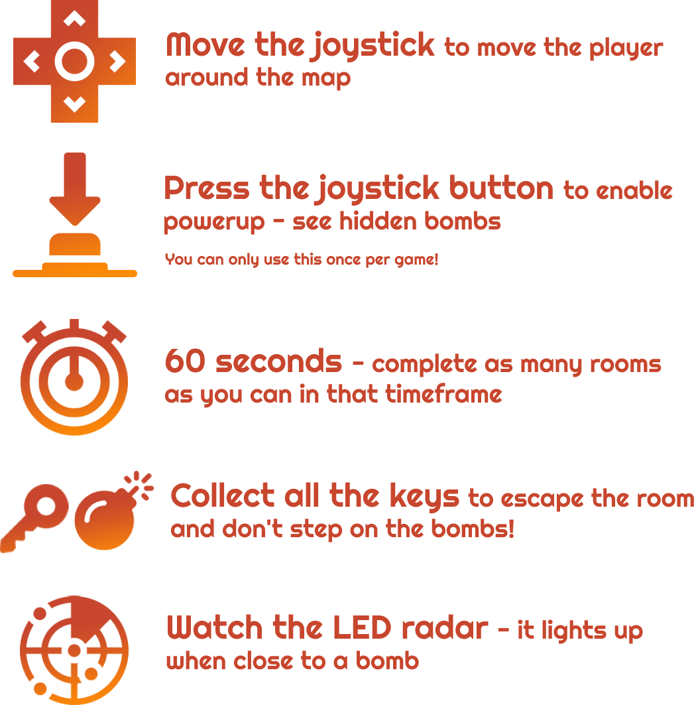

 

  
 

   

This game was created as part of the Introduction to Robotics course I took during my 3rd year of studying Computer Science @ University of Bucharest, Faculty of Mathematics and Computer Science. It is written in C++ and the Arduino libraries, and was created during the span of a month.
  
I chose this game because I believed that it would best fit the restrictions of the hardware (8x8 single-color led matrices don't allow lots of expression 😛). I also wanted to implement a game with a panning camera, I thought it would be an interesting technical challenge. 

  I'm not aware of any other game that plays similarly - I'd call it a bit similar to Minesweeper, but that's about it.
  

   
  
🔥**Cave Run**🔥 is a game where you must _escape as many rooms as you can_ in 60 seconds ⌚.

To exit a room, you must collect all the keys 🔑 while avoiding the bombs 💣. 

The bombs are buried underground, but thankfully you are equipped with your trusty radar 📡 that warns you if you're approaching a bomb. 

_**Don't get blown up! 💥**_

😎 Complete menu

🗺 Procedural generation

🏋 Multiple difficulty settings

🔲 Multple room sizes

🏆 Scoreboard

🛠 Customizable settings

🎹 Theme song and sound effects!!!! as well as a muting option 

⬆ Power-up: on click, see bombs in room

🎉 Endless fun!

   
     
  

   

   
  
 💥 1 Arduino Uno
 
 💥 1 8x8 LED Matrix
 
 💥 1 16x2 LCD 
 
 💥 1 joystick
 
 💥 1 passive buzzer
 
 💥 1 5k Ohm potentiometer
 
 💥 1 matrix driver
 
 💥 1 red LED
 
 💥 lots and lots of wires

   

[Early Demo](https://youtu.be/ydcTGkUH4vE)
